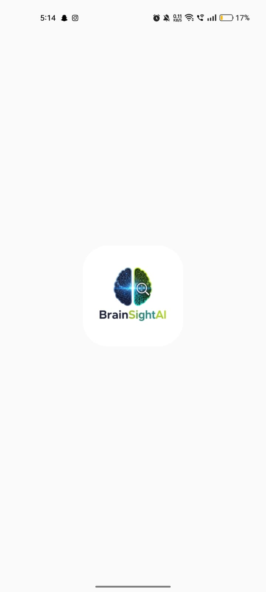
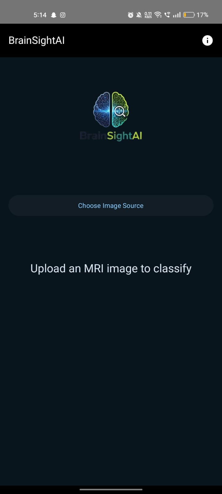

# BrainSightAI: Explainable Brain Tumor Classifier 🧠

## Overview

BrainSightAI is a mobile application developed using **Kotlin** and **Jetpack Compose** that leverages **PyTorch Mobile** to classify brain MRI scans. Beyond just providing a prediction, the app is designed with an emphasis on **Explainable AI (XAI)**, though the XAI features (Grad-CAM, LIME) are planned for a future release (v2.0) and would run on a backend server. This version (v1.0) focuses on robust on-device inference for initial tumor classification.

The application can classify MRI images into one of four categories: `glioma`, `meningioma`, `pituitary`, or `notumor` (no tumor). It provides a confidence score for each prediction, aiding in preliminary analysis.

## Features (v1.0)

* **On-Device AI Inference**: Utilizes a pre-trained PyTorch model for rapid brain tumor classification directly on the Android device.
* **Four-Class Classification**: Distinguishes between `glioma`, `meningioma`, `pituitary`, and `notumor`.
* **Image Selection**: Users can select MRI images from their device's gallery or capture new images using the camera.
* **Intuitive UI**: Built with Jetpack Compose for a modern, responsive, and user-friendly experience.
* **Prediction Confidence**: Displays the model's confidence level for each classification.
* **Disclaimer**: Includes a clear disclaimer regarding AI-generated responses.
* **About/Credits Dialog**: Provides information about the app and acknowledges contributors.

## Technologies Used

* **Language**: Kotlin
* **UI Toolkit**: Jetpack Compose
* **AI Framework**: PyTorch Mobile
* **Architecture**: MVVM (Model-View-ViewModel)
* **Build System**: Gradle Kotlin DSL

## Screenshots / Demo




## Setup Instructions

To get a local copy up and running, follow these simple steps.

### Prerequisites

* Android Studio (Latest Stable Version recommended)
* Android SDK (API Level 29 or higher)
* Kotlin Plugin for Android Studio (usually pre-installed)
* Your `brain_tumor_model.pt` file (the TorchScript model)

### Installation

1.  **Clone the Repository**
```bash
git clone [https://github.com/buildwithnomi/BrainSightAI.git](https://github.com/buildwithnomi/BrainSightAI.git)
cd BrainSightAI
```

2.  **Place the Model File**
    * Copy your `brain_tumor_model.pt` file into the `app/src/main/assets/` directory of the project.

3.  **Open in Android Studio**
    * Open the cloned project in Android Studio.

4.  **Sync Gradle**
    * Android Studio should automatically prompt you to sync Gradle. If not, click **File > Sync Project with Gradle Files**.

## How to Run the App

1.  **Select a Device**: Choose an Android emulator or connect a physical Android device (with USB debugging enabled).
2.  **Run**: Click the **Run** button (green triangle) in Android Studio.

The app will build and install on your selected device.

## Future Enhancements (v2.0)

* **On-Device Explainable AI**: Integration of Grad-CAM and LIME for visual explanations of model predictions directly on the device.
* **Expanded Classification**: Support for a wider range of brain diseases, pending access to more diverse medical datasets and collaboration with medical institutions.
* **Backend Integration**: Potentially move complex XAI computations to a Flask backend server for faster processing and richer visualizations.

## Credits & Acknowledgments

* **Developed by**: Noman & Ayman
* **Original Model (`.pth` file) provided by**: Ayman ([@aymnsk](https://github.com/aymnsk))
* **Frameworks & Libraries**: PyTorch Mobile, Jetpack Compose, AndroidX Libraries

## License

This project is licensed under the MIT License - see the [LICENSE](LICENSE) file for details.